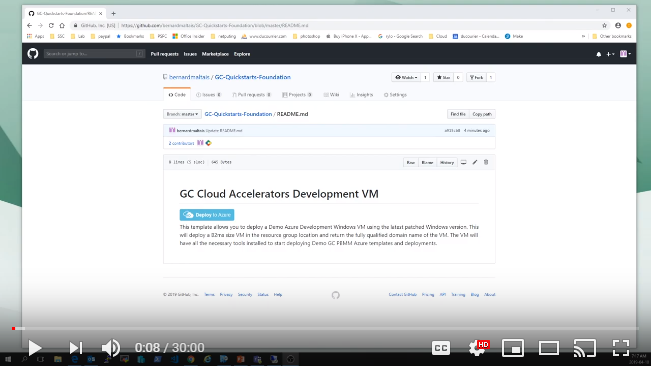

# GC Cloud Accelerator Development VM

This template allows you to deploy a 1st Azure Development Windows VM using the latest patched Windows Server 2016 version. This will deploy a D2s_v3 size VM in the resource group location and return the fully qualified domain name of the VM. The VM will have all the necessary tools installed to start deploying GC Cloud Accelerator Azure templates and deployments.

## HOWTO Video tutorial

A video tutorial on how to deploy the VM on Azure and use the VM to build your 1st Azure infrastructure can be found here: 

The URL for the GC Cloud Accelerator Azure deployments library is:

https://dev.azure.com/GC-Quickstarts/Azure-Deployments (need to be updated to future github link)

## Demo Infrastructure deployment order

When you have cloned the deployment library you are ready to deploy your 1st environment. To do this it is suggested you 1st start with the demov3\msfirewall example. The reason being that no vendor specific firewall license is required to properly deploy this version of the demo infrastructure with success.

On GC Cloud Accelerator Development VM go in the demov3\msfirewall\demo-core-msfw-nsg folder.
Login to your Azure subscription with:

`
login-azurermaccount
`

Select the desired subscription (if you have more than one) with:

`
get-azurermsubscription
select-azurermsubscription <name>
`

Deploy the core infrastructure with:

`
.\masterdeploy.ps1
`
